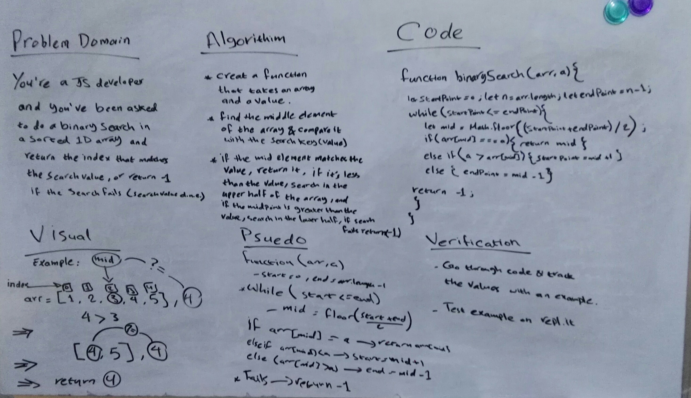

# Binary Search in a Sorted 1D Array
<!-- Short summary or background information -->

## Challenge
**Create a function that takes in a sorted array and a search key as an argument, and return the index of the array’s element that is equal to the search key, or -1 if the element does not exist.** 

## Approach & Efficiency
**I started by searching and reading about binary search and followed along with a worked example, and then I created my own code following step by step with worked example to make sure I understand it.**

## Solution
