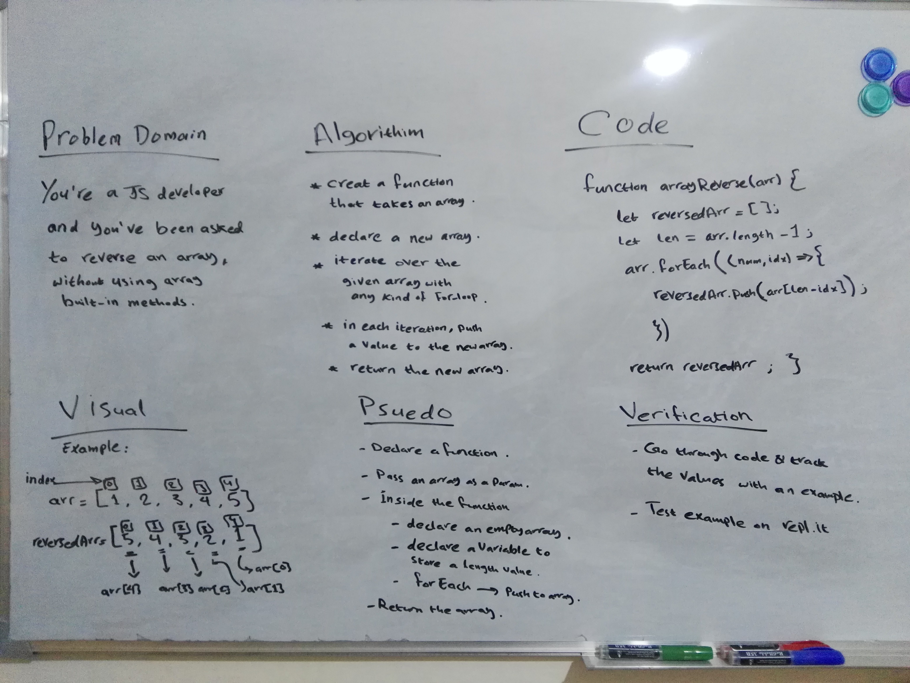

# Reverse an Array
<!-- Short summary or background information -->

## Challenge
**Create a function that takes in an array as an argument, and returns another array with the elements of the first array in reversed order.** 

## Approach & Efficiency
**I went with the approach of writting an example with a sample array and its reversed array, and then I tried to express each element of the reversed array in terms of the sample array and detected a pattern.**

## Solution
