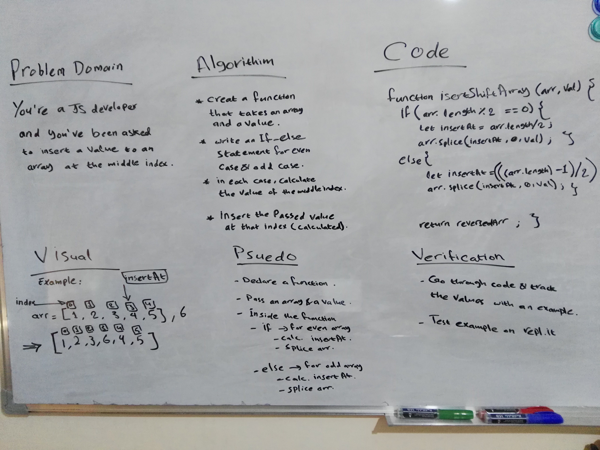

# Shift an Array
<!-- Short summary or background information -->

## Challenge
**Create a function that takes in an array and a value as an argument, and returns an array with the value added to the array at the middle index.** 

## Approach & Efficiency
**I went with the approach of writting an example with two sample arrays, one that is even and one that is odd, and then I tried to find the value of the middle index in terms of the array length and a factor of (2), and came up with a formula for each array (the even and the odd), then I searched for how to insert an element at a given index and used `slice` for that.**

## Solution
