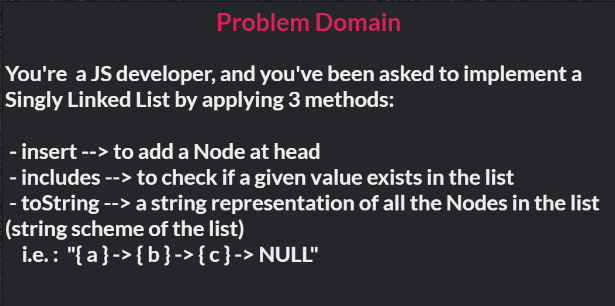
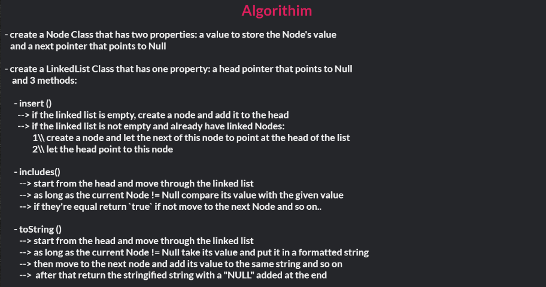
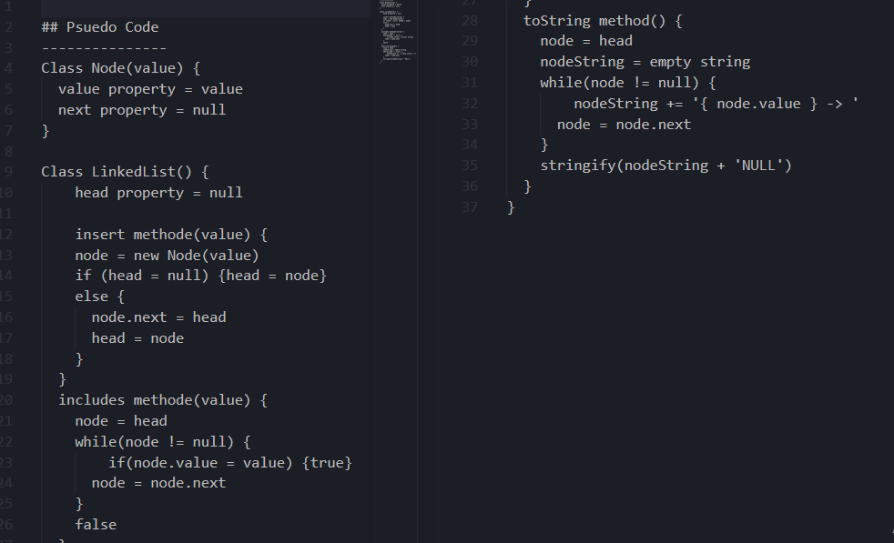
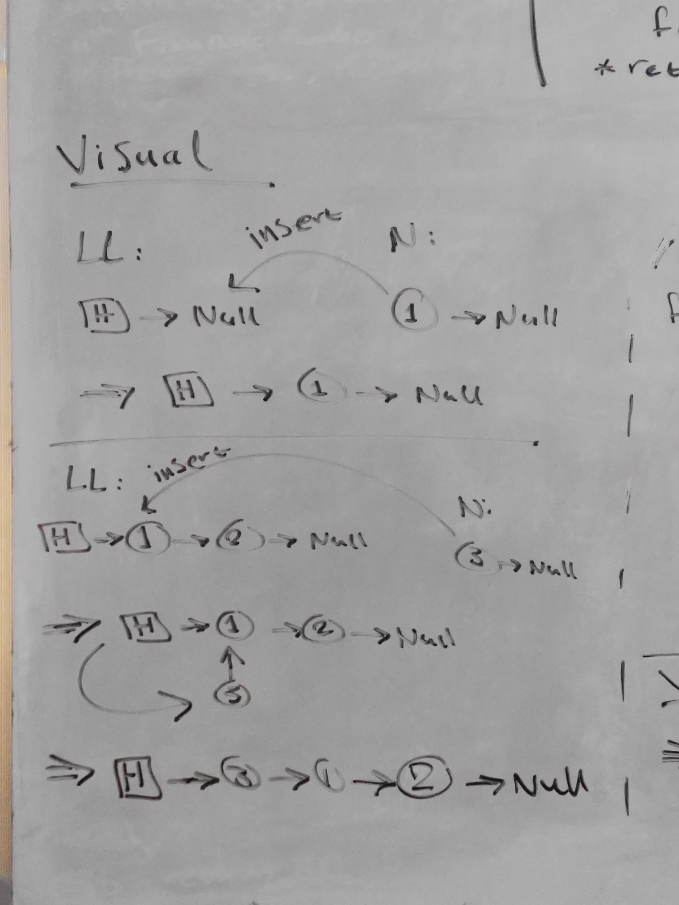

# Singly Linked Lists 

## Background Summary
- Linked Lists are a dynamic type of data structures.  
- A Linked List is an ordered chain of nodes that are linked together by reference.  
- Unlike Arrays, Linked Lists use a referencing system and do not store data in a fixed memory locations, the memory size can be dynamically modified during runtime.  
- A Linked List has a pointer property, the _header_, which points to the first node in the list.  
If  the LL is empty, the header points to Null.
- A Singly Linked List is a linear, uni-directional type of LLs in which data are stored in node elements that contain two properties, one to store the data, and a _next_ pointer that points (references) to the next node in the list.  
The last node in the list points to Null. 
- In a Singly LL nodes can be accessed only through the head and the next pointers by traversing the list in one direction, starting from the node at head.

## Challenge Description 
**JS Singly Linked List Implementation**  
Implement Singly LLs in JS by creating a Node Class, and a Linked List Class with 3 methods:
- insert --> to add a Node at head
- includes --> to check if a given value exists in the list
- toString --> a string representation of all the Nodes in the list (string scheme of the list)  
i.e. : `"{ a } -> { b } -> { c } -> NULL"`

## Approach & Efficiency
**Approach**  
- defining the classes for the Node and the Linked List
- visualizing the LL with an example to help impleminting the features and methods  
i.e. :
```javascript 
//creating an empty LL
LL: [H] -> Null;

//Adding a Node to the LL
N: (1) -> Null;
LL: [H] -> (1) -> Null;

//inserting at head
LL: [H] -> (1) -> (2) -> Null;
N: (3) -> Null;
=> [H] -> (1) -> (2) -> Null
           ^
           |
          (3);
=> [H] -> (3) -> (1) -> (2) -> Null;

```
**Efficiency: Big O Notation**  
- Time Complexity:
  - O(1) --> inserting Nodes in the LL
  - O(n) --> traversing the LL to search for a value
- Space Complexity:
  - O(n)

## WhiteBoard / CI
- [Github Actions](https://github.com/bushra-401-advanced-javascript/data-structures-and-algorithms/actions?query=is%3Asuccess)  










